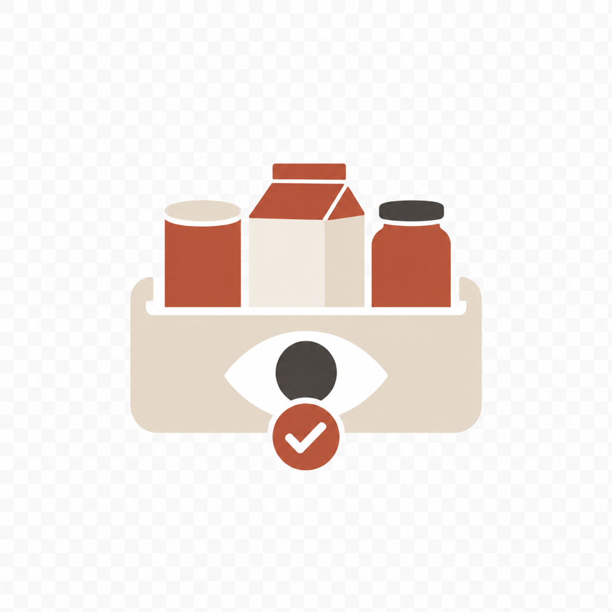
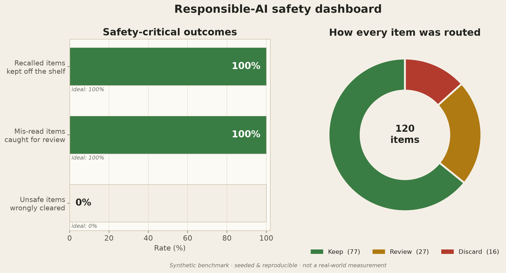

<div align="center">



# ShelfSight

**The pantry shelf, read for you.**

A food-bank intake assistant that reads donated food labels with a phone camera, checks each item against live federal recall data, flags allergens and dietary categories, and turns a shelf of unlabeled donations into an inventory a family can actually search.

<br />

[](https://ai.google.dev/)
[](https://reactnative.dev/)
[](https://expo.dev/)
[](https://www.typescriptlang.org/)

[](https://www.sqlite.org/)
[](https://open.fda.gov/)
[](https://www.python.org/)
[](LICENSE)

</div>

---

## The problem

There are roughly 60,000 food pantries in the United States, and most run on volunteers and clipboards with no inventory system. Donations arrive unsorted, unbarcoded, and undated. Some are already expired. Some are under an active federal recall that never reaches a church basement. A grocery shopper gets recall alerts and clear labels for free; a family picking up food from a pantry shelf gets neither.

The people this hurts most are the ones who can least afford a mistake: a parent of a child with a peanut allergy, someone managing diabetes, a senior with a religious dietary need. Picture a grandson searching a pantry shelf for something his diabetic grandmother can safely eat. The information he needs exists, but it is scattered across labels no one has time to read.

## What ShelfSight does

As a volunteer sorts donations, they hold each item up to the phone camera. ShelfSight:

1. **Reads the label** with a vision model — brand, product, ingredients, dates.
2. **Tags allergens** against the FDA "big 9," with the ingredient words that justify each tag.
3. **Checks live federal recalls** by querying the openFDA enforcement database in real time.
4. **Gives a clear recommendation** — keep, discard, or send to review — with the reason in plain language.

A volunteer confirms every item before it reaches the shelf. Cleared items become a searchable inventory, so when a family asks "what is here with no peanuts?" the answer is a filtered list with the ingredients spelled out, not a guess.

## How the AI works

ShelfSight is an agentic pipeline, not a single prompt. Each scan flows through perception, classification, an external-tool call, and a confidence-gated decision:

```
  Photo of a donated item
        │  downscaled on-device (cuts vision tokens ~69%)
        ▼
  ┌──────────────────────────────────────────────┐
  │  Vision + extraction   (Gemini 2.5 Flash)     │
  │  brand · product · ingredients · date         │
  │  confidence · legibility notes                │
  └──────────────────────────────────────────────┘
        ▼
  ┌──────────────────────────────────────────────┐
  │  Classification                               │
  │  allergens → FDA big-9, with supporting words │
  │  dietary tags → what the label claims         │
  └──────────────────────────────────────────────┘
        ▼
  ┌──────────────────────────────────────────────┐
  │  Recall check   (live openFDA query)          │
  │  brand-anchored match against active recalls  │
  │  3s timeout → cached snapshot fallback        │
  └──────────────────────────────────────────────┘
        ▼
  ┌──────────────────────────────────────────────┐
  │  Verdict + routing                            │
  │  recall / expired      → discard              │
  │  unsure / unreadable   → review (ask a human) │
  │  clean read, no recall → keep                 │
  └──────────────────────────────────────────────┘
        ▼
  Human clearance  →  searchable, plain-language inventory
```

A web search cannot solve this. The family does not know what they are holding or what to type, and no search engine knows what a specific pantry has on its shelves right now or whether it has been recalled. Reading the physical items and building a live inventory is the part only a vision-and-retrieval pipeline can do.

The recall verdict reasons only over the records retrieved from openFDA and the scanned label, and cites them — so it cannot invent a recall that does not exist. Tags are always framed as *what the label shows*, never as a guarantee that a food is safe to eat.

## Safety by design

A wrong tag is more dangerous than no tag, because it creates false confidence. ShelfSight is built so the model's mistakes never reach a family:

- **It never certifies food as safe.** Every screen reads *here is what the label shows — check the label to confirm.*
- **A human clears every item.** This is enforced in the database, not just the interface: an item under an active recall cannot be cleared onto the shelf no matter what calls the function.
- **It escalates instead of guessing.** When the read is low-confidence or the label is unreadable, the item goes to a volunteer rather than onto the shelf.
- **Recall matching is conservative.** A brand-anchored match against only *active* recalls returns a possible match for a person to verify, never an automatic confirmation and never an automatic clear.

## Evaluation

The intake pipeline was measured against a synthetic benchmark of 120 labeled cases. The full methodology, charts, and a one-command reproduction live in [`docs/evaluation/`](docs/evaluation/).

<div align="center">

</div>

| Metric | Result |
| --- | ---: |
| Recalled items kept off the shelf | 100% |
| Unsafe items wrongly cleared | 0% |
| Mis-read items caught for review | 100% |
| Accuracy when the model is confident | 98% |
| Overall extraction accuracy | 78% |

The model is good but imperfect — and the system is designed so its imperfections are caught before they reach a vulnerable family.

## Tech stack

| Area | Tool |
| --- | --- |
| Vision, extraction, classification | Google Gemini 2.5 Flash (`@google/genai`) |
| Recall data | openFDA Food Enforcement API (live, no key) |
| App | React Native + Expo (SDK 56), TypeScript |
| On-device storage | SQLite (`expo-sqlite`) — family search is a SQL filter |
| Camera & images | `expo-camera`, `expo-image-picker`, `expo-image-manipulator` |
| UI & motion | `react-native-reanimated`, React Navigation, `expo-blur` |
| Evaluation | Python, matplotlib, NumPy |

## Getting started

```bash
npm install
cp .env.example .env        # add a free Gemini key from aistudio.google.com/apikey
npm run ios                 # or: npm run android
```

A realistic demo pantry is seeded on first launch — including a recall match, an allergen flag, and an unreadable-label escalation — so every screen is populated immediately. Add a Gemini key in the **Settings** tab to scan real labels.

## Project structure

```
src/
  ai/            Gemini client, structured-output schema, key handling
  recall/        Live openFDA recall service + safe matcher + cached fallback
  db/            SQLite inventory, item view-model, keep/discard logic
  components/    Cards, detail sheet, status signal, pipeline trace, brand mark
  screens/       Intake · Inventory · Shelf · Settings
  theme/         Design tokens
docs/evaluation/ Synthetic benchmark, evaluation harness, charts
assets/          Logo, app icon, splash
```

## License

Released under the [MIT License](LICENSE).
