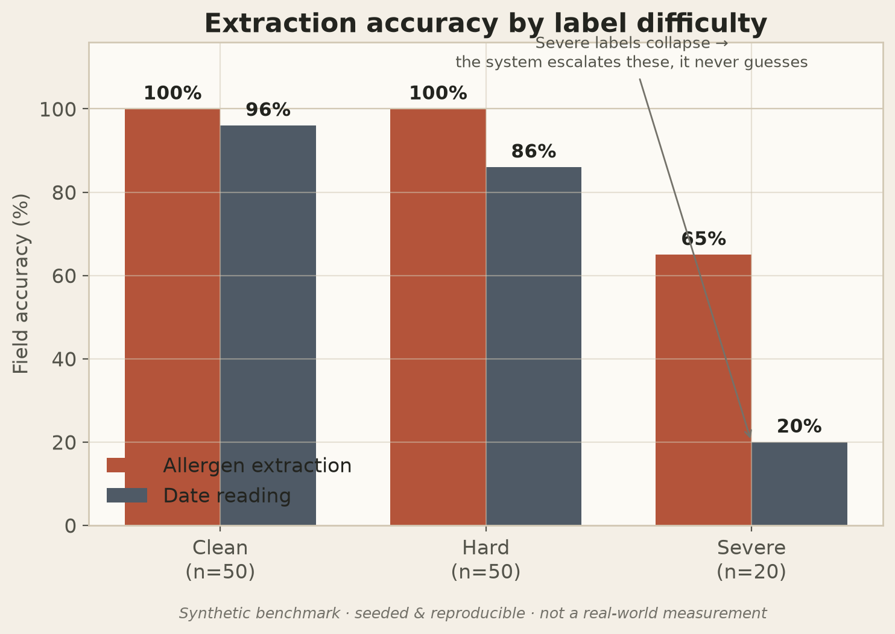
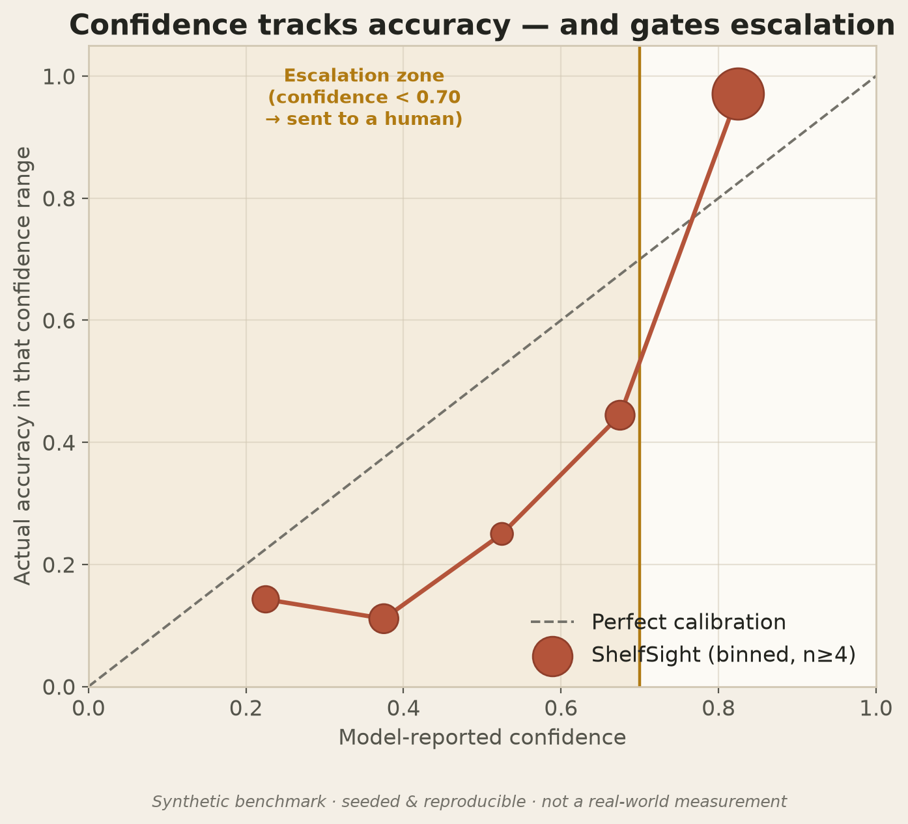
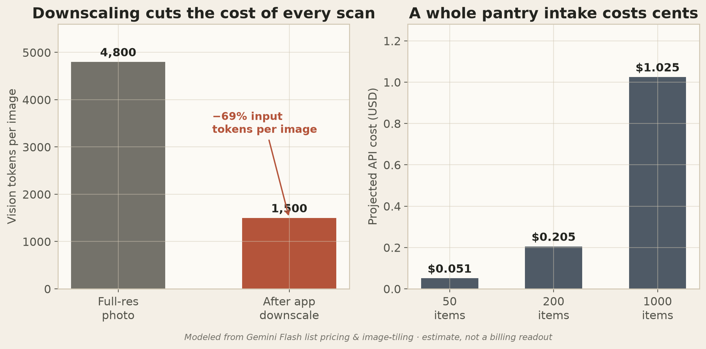

# ShelfSight — Model Evaluation

A reproducible evaluation of the ShelfSight intake pipeline against a synthetic, labeled benchmark of 120 food-donation cases. The data is synthetic and every chart is labeled as such — these are not real-world measurements. The goal is to stress the part that matters most, the safety logic, against known-hard cases (recalls, illegible labels, allergen traps), in a way anyone can regenerate with one command.

## Headline numbers

| Metric | Result | Why it matters |
|---|---:|---|
| **Recall items kept off the shelf** | **100%** | The highest-stakes job. A recalled item must never reach a family. |
| **Unsafe items wrongly cleared** ("false-safe") | **0%** | The system never says "keep" for a recalled or expired item. |
| **Mis-read items caught for review** | **100%** | When the model reads a label wrong, the system escalates instead of trusting it. |
| Overall extraction accuracy | 78% | The model makes real mistakes; the safety layer catches them. |
| Allergen-extraction accuracy | 94% | The allergen tags families rely on. |
| Accuracy **when confident** (≥0.70) | 98% | Confident reads are almost always right. |
| Accuracy **when unsure** (<0.70) | 17% | Unsure reads are usually wrong — so the system sends them to a human. |
| Share of items escalated to a human | 24% | The model knows when to stop and ask. |

These numbers reflect the core design goal: the model is good but imperfect, and the system is built so its imperfections do not reach a vulnerable family. A 78% extraction accuracy paired with a 0% false-safe rate is the intended outcome — the safety layer absorbs the model's errors.

## The four charts

### 1. Extraction accuracy by label difficulty


Accuracy is near-perfect on clean labels and **collapses on torn/illegible ones** — by design. The system doesn't try to be a hero on a label it can't read; it escalates. Date reading is the most fragile field (a smudged "best by" is easy to misread), which is exactly why a missing or low-confidence date routes an item to human review.

### 2. Confidence calibration


The model's self-reported confidence **tracks its real accuracy**: low-confidence reads really are usually wrong, high-confidence reads really are usually right. This correlation is what makes the **escalation gate** meaningful — drawing the line at 0.70 cleanly separates the reliable reads from the ones a human needs to check.

### 3. Responsible-AI safety dashboard


The centerpiece. Of every truly-recalled item, **100% were kept off the shelf**; of every truly-unsafe item, **0% were wrongly cleared**; of every item the model mis-read, **100% were caught** for review. The donut shows how all 120 items were routed: most clear-eligible (a human still confirms), the rest sent to review or discard.

### 4. Efficiency at pantry scale


The app downscales each photo before sending it to the vision model, cutting input tokens **~69%**. Processing an entire 1,000-item pantry intake costs about **$1** — the "works on church-basement wifi, scales to a real pantry" story. *(Modeled from Gemini Flash list pricing and image-tiling; an estimate, not a billing readout.)*

## How the benchmark works (methodology)

```
benchmark.py   → builds 120 labeled cases (hand-authored anchors + a fixed product pool)
                 each case has GROUND TRUTH + a seeded, realistic SIMULATED model output
evaluate.py    → scores the pipeline's routing decisions against ground truth,
                 computes every metric, and renders the four charts + results.json
```

- **Ground truth** is exact and hand-specified (what allergens are *really* present, whether the item is *really* recalled or expired).
- **The simulated model** is deliberately imperfect, with error rates that scale by label difficulty (clean / hard / severe). Crucially, when it reads a label *wrong* it reports *lower* confidence — the realistic correlation that lets confidence-gated escalation work. These error rates are the single, auditable place "how good is the model" is encoded (see `PROFILE` in `benchmark.py`).
- **The routing logic** scored here mirrors the app's real code in [`src/db/recommendation.ts`](../../src/db/recommendation.ts): recall or past-date → **discard**; low-confidence, illegible, or no-date → **review**; otherwise → **keep** (and even then, a human clears it).
- **Recall matching** is modeled as exact, because in the real app it's an app-side retrieval step (lot code vs. live FDA/USDA feeds), not a vision guess — so it doesn't fail on label legibility.

### Why simulate instead of only calling Gemini live?
A live run needs an API key and is non-deterministic, so it can't be reproduced exactly. This benchmark is seeded and deterministic — same command, same numbers, every time — and stresses the safety logic against a controlled set of hard cases. The live pipeline runs on real photos in the app; this evaluation complements that by measuring the decision logic at scale.

## Reproduce it

```bash
cd docs/evaluation
python3 -m venv .venv && source .venv/bin/activate
pip install matplotlib numpy
python benchmark.py     # regenerate the 120-case dataset (deterministic)
python evaluate.py      # score it, render charts/, write results.json
```

Outputs: `benchmark.json` (the dataset), `results.json` (every metric), and `charts/*.png`.
